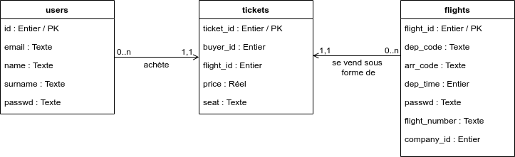

# Architecture générale / technos utilisées

L'application est découpée en deux parties : 
- en front-end sous la forme d'une application SPA, développé en HTML / CSS / React.js
- un back-end qui expose une API REST (Python / Flask) et avec laquelle communique le front en HTTP. Il requête aussi une base de données SQLite.

# Modèle de données

# Stack technique / technos utilisées

- Front : SPA en HTML / CSS / React.js
- Back-end : Python / Flask
- BDD : sqlite3
